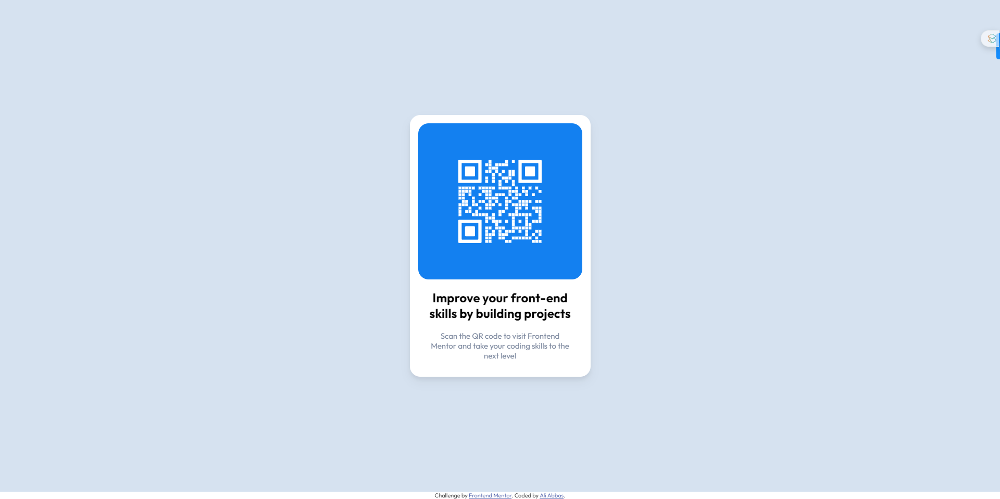

# Frontend Mentor - QR code component solution

This is a solution to the [QR code component challenge on Frontend Mentor](https://www.frontendmentor.io/challenges/qr-code-component-iux_sIO_H). Frontend Mentor challenges help you improve your coding skills by building realistic projects. 

## Table of contents

  - [Screenshot](#screenshot)
  - [Links](#links)
  - [Built with](#built-with)
- [Author](#author)

### Screenshot

### Links

- Solution URL: 

### Built with

- HTML5 markup
- CSS custom properties
- Flexbox

## Author

- Github - [@Ali-Abbas1](https://github.com/Ali-Abbas1)
- Frontend Mentor - [@Ali-Abbas1](https://www.frontendmentor.io/profile/Ali-Abbas1)

